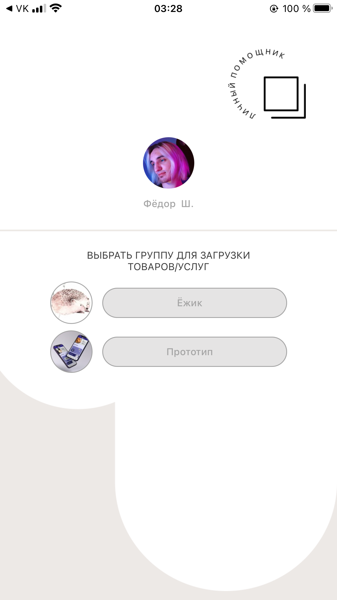
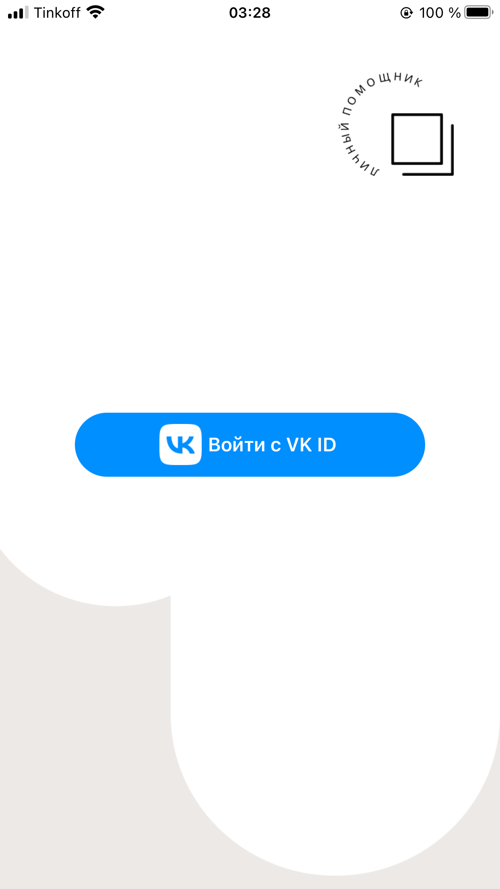
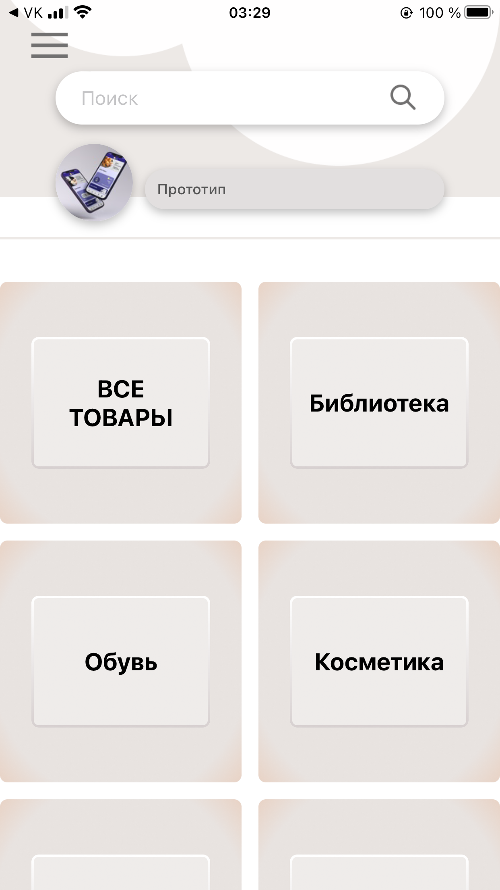
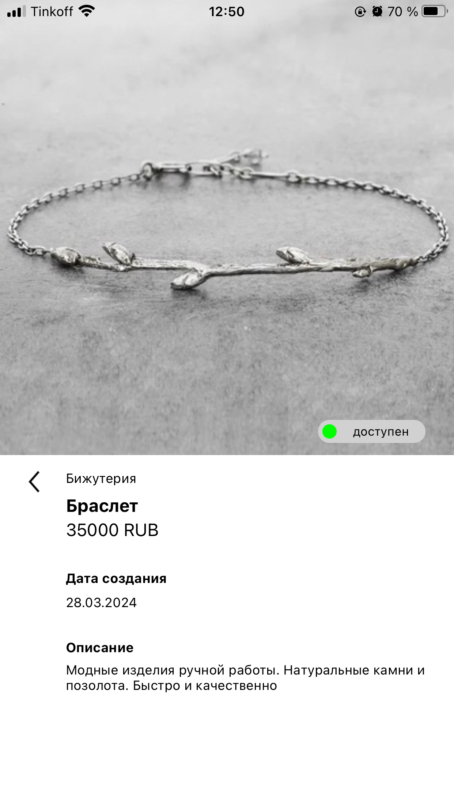
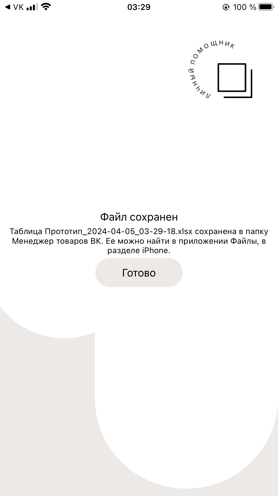

В целях соблюдения правил ВК, защищённый ключ и сервисный ключ доступа были убраны из кода.

# Приложение для работы с товарами ВК.  

Работа с товарами и подборками товаров, групп, в которых у пользователя есть доступ к модерации секции товаров.

Возможность вывести товары в excel таблицу для ведения учета и упрощения составления отчетной документации.

## Использованые инструменты 
CocoaPods, VK ID SDK, Lottie Animation, libxlsxwriter, UiKit

## Превью 
<table>
  <tr>
    <td></td>
    <td></td>
    <td></td>
  </tr>
</table>

<table>
  <tr>
    <td></td>
    <td></td>
    <td></td>
  </tr>
</table>

<table>
  <tr>
    <td></td>
    <td></td>
    <td></td>
  </tr>
</table>
